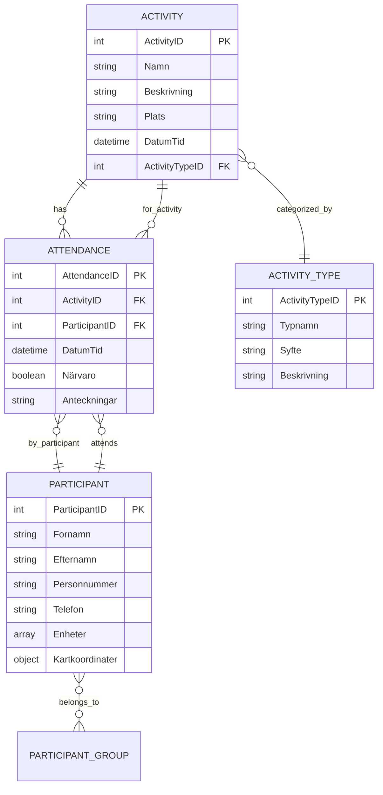

# API Architecture & Relational Data Management

This document provides a comprehensive overview of how the API layer handles
both mock and real API implementations, with special focus on relational data
management and dictionary building computations.

## 📋 Table of Contents

- [Overview](#overview)
- [Dual API Architecture](#dual-api-architecture)
- [Relational Data Structure](#relational-data-structure)
- [Dictionary Building & Computations](#dictionary-building--computations)
- [Mock vs Real API Handling](#mock-vs-real-api-handling)
- [Data Relations](#data-relations)
- [Service Layer Architecture](#service-layer-architecture)
- [Usage Examples](#usage-examples)
- [Advanced Patterns](#advanced-patterns)

## Overview

The API layer is designed with a dual-mode architecture that seamlessly switches
between mock data (for development) and real API endpoints (for production). The
system is built to handle complex relational data structures and provides
efficient methods for building dictionaries and performing computations across
related entities.

## Dual API Architecture

### Environment-Based Switching

The API automatically determines which implementation to use based on
environment variables:

```typescript
const USE_MOCK_API =
  import.meta.env['VITE_USE_MOCK_API'] === 'true' || import.meta.env.DEV;
```

### Implementation Pattern

```typescript
export const api = {
  activities: {
    getAll: (params?: RequestParams) =>
      USE_MOCK_API
        ? (apiService as MockDataService).getActivities()
        : (apiService as ApiConfiguration).activities.getAll(params),
    // ... other methods
  },
};
```

This pattern ensures:

- **Consistent Interface**: Same API surface regardless of implementation
- **Feature Parity**: Mock supports core operations, real API supports advanced
  features
- **Graceful Degradation**: Mock methods that aren't implemented return
  meaningful errors

## Relational Data Structure

### Core Entities and Their Relations



### Data Examples

**Activity Structure:**

```json
{
  "ActivityID": 1,
  "Namn": "Öppen fritidsgård måndag",
  "Beskrivning": "Öppen verksamhet för alla ungdomar",
  "Plats": "Fritidsgården lokaler",
  "DatumTid": "2024-01-15T15:00:00",
  "ActivityTypeID": 1
}
```

**Attendance Structure (Linking Activities & Participants):**

```json
{
  "AttendanceID": 1,
  "ActivityID": 1,
  "ParticipantID": 2,
  "DatumTid": "2024-01-15T15:30:00",
  "Närvaro": true,
  "Anteckningar": "Deltog aktivt i aktiviteterna"
}
```

## Dictionary Building & Computations

### 1. Activity-Participant Relations

The mock service provides methods to build dictionaries and perform computations
across relations:

```typescript
// Get participants for a specific activity
async getParticipantsByActivityId(activityId: string): Promise<ApiResponse<Participant[]>> {
  // 1. Find all attendances for the activity
  const activityAttendances = attendancesData.filter(a => a.ActivityID.toString() === activityId);

  // 2. Extract unique participant IDs
  const participantIds = [...new Set(activityAttendances.map(a => a.ParticipantID))];

  // 3. Build participant dictionary/lookup
  const participants = participantsData.filter(p =>
    participantIds.includes(p.ParticipantID)
  );

  return this.mockRequest(participants as Participant[]);
}
```

### 2. Attendance Computations

**Mock Implementation:**

```typescript
// Build attendance records by activity
async getAttendancesByActivityId(activityId: string): Promise<ApiResponse<Attendance[]>> {
  const activityAttendances = attendancesData.filter(a =>
    a.ActivityID.toString() === activityId
  );
  return this.mockRequest(activityAttendances as Attendance[]);
}
```

**Real API Implementation:**

```typescript
// AttendanceService provides advanced computations
async getStatistics(activityId?: string): Promise<ApiResponse<{
  totalAttendances: number;
  presentCount: number;
  absentCount: number;
  attendanceRate: number;
}>> {
  const params: QueryParams = activityId ? { activityId } : {};
  return this.get(`${this.endpoint}/statistics`, params);
}
```

### 3. Cross-Entity Dictionary Building

Example of building comprehensive dictionaries across entities:

```typescript
// Build activity dictionary with related data
async buildActivityDictionary() {
  const activities = await api.activities.getAll();
  const activityTypes = await api.activityTypes.getAll();

  // Create lookup dictionary for activity types
  const typeDict = activityTypes.data.reduce((dict, type) => {
    dict[type.ActivityTypeID] = type;
    return dict;
  }, {} as Record<number, ActivityType>);

  // Enrich activities with type information
  const enrichedActivities = activities.data.map(activity => ({
    ...activity,
    type: typeDict[activity.ActivityTypeID],
    // Add computed fields
    displayName: `${activity.Namn} (${typeDict[activity.ActivityTypeID]?.Typnamn})`,
    dateFormatted: new Date(activity.DatumTid).toLocaleDateString('sv-SE')
  }));

  return enrichedActivities;
}
```

## Mock vs Real API Handling

### Mock Data Service Features

**Strengths:**

- ✅ Fast development iteration
- ✅ Realistic data relationships
- ✅ Network delay simulation
- ✅ Error scenario testing
- ✅ Consistent CRUD operations
- ✅ Cross-entity relationship handling
- ✅ Memory-based data (resets on reload)

**Limitations:**

- ❌ Limited advanced filtering

**Mock Implementation Pattern:**

```typescript
async getParticipantsByActivityId(activityId: string): Promise<ApiResponse<Participant[]>> {
  // Step 1: Find attendance records
  const activityAttendances = attendancesData.filter(a =>
    a.ActivityID.toString() === activityId
  );

  // Step 2: Build participant ID set
  const participantIds = [...new Set(activityAttendances.map(a => a.ParticipantID))];

  // Step 3: Fetch participants using dictionary lookup
  const participants = participantsData.filter(p =>
    participantIds.includes(p.ParticipantID)
  );

  return this.mockRequest(participants as Participant[]);
}
```

### Real API Service Features

**Strengths:**

- ✅ Server-side filtering and sorting
- ✅ Advanced queries and aggregations
- ✅ Real-time data updates
- ✅ Optimized database queries
- ✅ Bulk operations
- ✅ Advanced statistics and computations

**Real API Implementation Pattern:**

```typescript
async getByActivityId(activityId: string): Promise<ApiResponse<Attendance[]>> {
  // Delegate to server with optimized query
  return this.get<Attendance[]>(`/activities/${activityId}/attendances`);
}

async bulkMarkAttendance(
  activityId: string,
  attendances: Array<{
    participantId: string;
    present: boolean;
    notes?: string;
  }>
): Promise<ApiResponse<Attendance[]>> {
  // Server handles bulk operations efficiently
  return this.post<Attendance[]>(`${this.endpoint}/bulk-mark`, {
    activityId,
    attendances,
  });
}
```

## Data Relations

### Primary Relations

1. **Activity ↔ Attendance ↔ Participant**

   - Many-to-many relationship through attendance records
   - Enables tracking who attended which activities

2. **Activity ↔ ActivityType**

   - One-to-many relationship
   - Categorizes activities by type/purpose

3. **Participant ↔ ParticipantGroup**
   - Many-to-many relationship
   - Groups participants by various criteria

### Relationship Handling Patterns

**1. Foreign Key Resolution:**

```typescript
// Mock: Manual FK resolution
const activity = activitiesData.find(a => a.ActivityID.toString() === id);
const activityType = activityTypesData.find(
  at => at.ActivityTypeID === activity.ActivityTypeID
);

// Real API: Server-side joins
return this.get<Activity>(`${this.endpoint}/${id}?include=activityType`);
```

**2. Cross-Entity Queries:**

```typescript
// Mock: Multi-step filtering
const getParticipantActivities = (participantId: string) => {
  const userAttendances = attendancesData.filter(a =>
    a.ParticipantID.toString() === participantId
  );
  const activityIds = userAttendances.map(a => a.ActivityID);
  return activitiesData.filter(a => activityIds.includes(a.ActivityID));
};

// Real API: Optimized query
async getByParticipantId(participantId: string): Promise<ApiResponse<Activity[]>> {
  return this.get<Activity[]>(`/participants/${participantId}/activities`);
}
```

## Service Layer Architecture

### Base Service Pattern

All services extend `BaseService<T>` which provides:

```typescript
abstract class BaseService<T> {
  protected httpClient: HttpClient;
  protected endpoint: string;

  // Standard CRUD operations
  async getAll(params?: RequestParams): Promise<ApiResponse<T[]>>;
  async getById(id: string): Promise<ApiResponse<T | null>>;
  async create(data: Partial<T>): Promise<ApiResponse<T>>;
  async update(id: string, data: Partial<T>): Promise<ApiResponse<T>>;
  async delete(id: string): Promise<ApiResponse<boolean>>;

  // Protected helpers for custom endpoints
  protected async get<TResult>(endpoint: string, params?: QueryParams);
  protected async post<TResult>(endpoint: string, data?: unknown);
  // ... other HTTP methods
}
```

### Domain-Specific Extensions

Services add domain-specific methods:

```typescript
export class AttendanceService extends BaseService<Attendance> {
  // Relational queries
  async getByActivityId(activityId: string): Promise<ApiResponse<Attendance[]>>;
  async getByParticipantId(
    participantId: string
  ): Promise<ApiResponse<Attendance[]>>;

  // Bulk operations
  async bulkMarkAttendance(
    activityId: string,
    attendances: BulkAttendanceData[]
  );

  // Computations
  async getStatistics(
    activityId?: string
  ): Promise<ApiResponse<AttendanceStats>>;
}
```

## Usage Examples

### Building Activity Dashboard Data

```typescript
async function buildActivityDashboard(activityId: string) {
  // Parallel data fetching
  const [activity, attendances, activityTypes] = await Promise.all([
    api.activities.getById(activityId),
    api.attendances.getByActivityId(activityId),
    api.activityTypes.getAll(),
  ]);

  // Build type dictionary
  const typeDict = activityTypes.data.reduce(
    (dict, type) => {
      dict[type.ActivityTypeID] = type;
      return dict;
    },
    {} as Record<number, ActivityType>
  );

  // Compute attendance statistics
  const totalAttendees = attendances.data.length;
  const presentCount = attendances.data.filter(a => a.Närvaro).length;
  const attendanceRate =
    totalAttendees > 0 ? (presentCount / totalAttendees) * 100 : 0;

  return {
    activity: {
      ...activity.data,
      type: typeDict[activity.data.ActivityTypeID],
    },
    statistics: {
      totalAttendees,
      presentCount,
      absentCount: totalAttendees - presentCount,
      attendanceRate: Math.round(attendanceRate * 100) / 100,
    },
    attendances: attendances.data,
  };
}
```

### Participant Activity History

```typescript
async function getParticipantHistory(participantId: string) {
  const participant = await api.participants.getById(participantId);

  if (USE_MOCK_API) {
    // Mock: Manual relationship building
    const userAttendances = await api.attendances.getAll();
    const participantAttendances = userAttendances.data.filter(
      a => a.ParticipantID.toString() === participantId
    );

    const activityIds = [
      ...new Set(participantAttendances.map(a => a.ActivityID)),
    ];
    const activities = await api.activities.getAll();
    const participantActivities = activities.data.filter(a =>
      activityIds.includes(a.ActivityID)
    );

    return {
      participant: participant.data,
      activities: participantActivities,
      attendances: participantAttendances,
      totalActivities: participantActivities.length,
      attendanceRate:
        (participantAttendances.filter(a => a.Närvaro).length /
          participantAttendances.length) *
        100,
    };
  } else {
    // Real API: Server-optimized queries
    const [attendances] = await Promise.all([
      api.attendances.getByParticipantId(participantId),
    ]);

    return {
      participant: participant.data,
      attendances: attendances.data,
      // Server can provide computed statistics
    };
  }
}
```

## Advanced Patterns

### 1. Data Normalization

```typescript
// Normalize related data into lookup dictionaries
class DataNormalizer {
  static normalizeActivitiesWithTypes(
    activities: Activity[],
    types: ActivityType[]
  ) {
    const typeDict = types.reduce(
      (dict, type) => {
        dict[type.ActivityTypeID] = type;
        return dict;
      },
      {} as Record<number, ActivityType>
    );

    return activities.map(activity => ({
      ...activity,
      _type: typeDict[activity.ActivityTypeID], // Denormalized type data
      _computed: {
        displayName: `${activity.Namn} - ${typeDict[activity.ActivityTypeID]?.Typnamn}`,
        category: typeDict[activity.ActivityTypeID]?.Syfte,
      },
    }));
  }
}
```

### 2. Caching Layer

```typescript
// Add caching for expensive computations
class CachedApiService {
  private cache = new Map<string, { data: any; timestamp: number }>();

  async getWithCache<T>(
    key: string,
    fetcher: () => Promise<T>,
    ttl = 300000
  ): Promise<T> {
    const cached = this.cache.get(key);
    if (cached && Date.now() - cached.timestamp < ttl) {
      return cached.data;
    }

    const data = await fetcher();
    this.cache.set(key, { data, timestamp: Date.now() });
    return data;
  }
}
```

### 3. Reactive Data Management

```typescript
// Vue composable for reactive data with relationships
export function useActivityWithRelations(activityId: Ref<string>) {
  const activity = ref<Activity | null>(null);
  const attendances = ref<Attendance[]>([]);
  const participants = ref<Participant[]>([]);
  const loading = ref(false);

  const loadData = async () => {
    loading.value = true;
    try {
      const [activityRes, attendancesRes] = await Promise.all([
        api.activities.getById(activityId.value),
        api.attendances.getByActivityId(activityId.value),
      ]);

      activity.value = activityRes.data;
      attendances.value = attendancesRes.data;

      // Build participant dictionary from attendances
      const participantIds = [
        ...new Set(attendances.value.map(a => a.ParticipantID)),
      ];
      const participantPromises = participantIds.map(id =>
        api.participants.getById(id.toString())
      );

      const participantResults = await Promise.all(participantPromises);
      participants.value = participantResults
        .map(result => result.data)
        .filter(Boolean) as Participant[];
    } finally {
      loading.value = false;
    }
  };

  // Computed relationships
  const enrichedAttendances = computed(() => {
    const participantDict = participants.value.reduce(
      (dict, p) => {
        dict[p.ParticipantID] = p;
        return dict;
      },
      {} as Record<number, Participant>
    );

    return attendances.value.map(attendance => ({
      ...attendance,
      _participant: participantDict[attendance.ParticipantID],
    }));
  });

  watchEffect(() => {
    if (activityId.value) {
      loadData();
    }
  });

  return {
    activity: readonly(activity),
    attendances: readonly(attendances),
    participants: readonly(participants),
    enrichedAttendances: readonly(enrichedAttendances),
    loading: readonly(loading),
    reload: loadData,
  };
}
```

## Best Practices

### 1. Always Handle Both Implementations

```typescript
// ✅ Good: Feature detection
const supportsAdvancedFiltering = !USE_MOCK_API;
if (supportsAdvancedFiltering) {
  return api.activities.getByDateRange(start, end);
} else {
  // Fallback for mock
  const all = await api.activities.getAll();
  return filterByDateRange(all.data, start, end);
}

// ❌ Bad: Assuming implementation
return api.activities.getByDateRange(start, end); // May not exist in mock
```

### 2. Optimize for Relations

```typescript
// ✅ Good: Batch related queries
const [activities, types, attendances] = await Promise.all([
  api.activities.getAll(),
  api.activityTypes.getAll(),
  api.attendances.getAll(),
]);

// ❌ Bad: Sequential queries
const activities = await api.activities.getAll();
const types = await api.activityTypes.getAll();
const attendances = await api.attendances.getAll();
```

### 3. Build Dictionaries Efficiently

```typescript
// ✅ Good: Single pass dictionary building
const typeDict = types.reduce(
  (dict, type) => {
    dict[type.ActivityTypeID] = type;
    return dict;
  },
  {} as Record<number, ActivityType>
);

// ❌ Bad: Repeated searches
activities.map(activity => ({
  ...activity,
  type: types.find(t => t.ActivityTypeID === activity.ActivityTypeID), // O(n²) complexity
}));
```

This architecture provides a robust foundation for handling complex relational
data while maintaining flexibility between development and production
environments.
