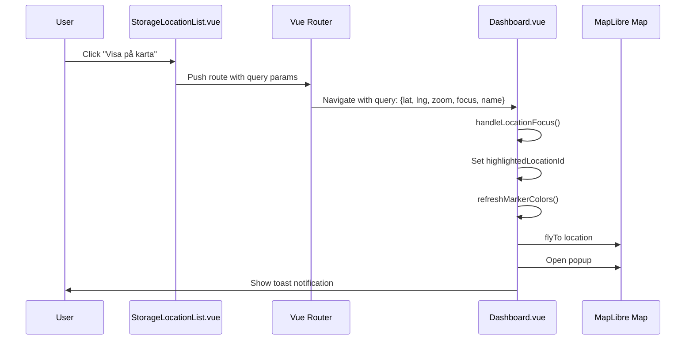

# Storage Management System Implementation Guide

## Overview

This document comprehensively explains the Storage Management System implementation for Stadsmissionen's boat storage application. The system integrates an interactive MapLibre map with a storage location list, providing seamless navigation, highlighting, and management capabilities for storage facilities (bryggor and lager).

## System Architecture

### Component Structure

```
Storage Management System
├── Dashboard.vue (Main Map Interface)
│   ├── Interactive MapLibre Map
│   ├── Storage Location Markers
│   ├── Style Switcher (Satellite/Streets/Hybrid)
│   ├── Highlighting System
│   ├── Relocate/Add New Functionality
│   ├── Change Tracking & Saving
│   └── Query Parameter Navigation
├── StorageLocationList.vue (List Interface)
│   ├── ListPage.vue (Shared Component)
│   ├── Filterable Data Table
│   ├── Search & Filter Controls
│   ├── Row Actions (Visa på karta, Edit, Delete)
│   └── Navigation to Dashboard
└── Data Integration
    ├── combinedStorage.json
    ├── companies.json
    └── Type Definitions
```

## Core Components

### 1. Dashboard.vue - Interactive Map Interface

**Location**: `src/views/Dashboard.vue`
**Route**: `/dashboard`
**Purpose**: Main map interface for visualizing and managing storage locations

#### Key Features:

1. **MapLibre GL JS Integration**
   - Three map styles: Satellite (Esri), Streets (OpenStreetMap), Hybrid (MapTiler)
   - Dynamic style switching with marker persistence
   - Navigation controls and responsive design

2. **Storage Location Markers**
   - Color-coded markers: Green (Bryggor), Red (Lager), Orange (New locations)
   - Interactive popups with detailed information
   - Scalable markers based on type and state

3. **Highlighting System**
   - Individual location highlighting from list navigation
   - Gray out non-selected markers
   - Pulse animation and enhanced visual effects
   - "Rensa markering" functionality

4. **Relocate & Add Functionality**
   - Click-to-place new storage locations
   - Click-to-relocate existing locations
   - Visual feedback during operations
   - Change tracking system

5. **State Management**
   - Reactive state for highlighting, relocating, and changes
   - Toast notification system
   - Unsaved changes tracking

#### State Variables:

```javascript
// Map and UI state
const map = ref<Map>();
const markers = ref<any[]>([]);
const selectedStyle = ref('streets');

// Change tracking
const locationChanges = ref<Record<string, any>>({});
const hasUnsavedChanges = computed(() => Object.keys(locationChanges.value).length > 0);

// Relocate mode
const relocateMode = ref<'add' | 'relocate' | null>(null);
const relocateTargetId = ref<number | null>(null);
const isRelocateMode = computed(() => relocateMode.value !== null);

// Highlighting mode
const highlightedLocationId = ref<number | null>(null);
const isHighlightMode = computed(() => highlightedLocationId.value !== null);
```

#### Core Functions:

```javascript
// Marker Management
addStorageLocationMarker(location) // Creates markers with state-aware colors
clearAllMarkers() // Removes all markers
refreshMarkerColors() // Updates marker colors based on current state

// Highlighting System
highlightLocationOnMap(locationId, locationName) // Highlights specific location
clearHighlight() // Clears highlighting state

// Relocate System
startRelocate(locationId, locationName) // Enters relocate mode
startAddNewStorage() // Enters add mode
cancelRelocate() // Exits relocate/add modes

// Navigation Integration
handleLocationFocus() // Processes query parameters from list navigation
```

### 2. StorageLocationList.vue - List Interface

**Location**: `src/views/StorageLocationList.vue`
**Route**: `/storage/locations`
**Purpose**: Comprehensive list view of all storage locations with filtering and navigation

#### Key Features:

1. **Data Processing**
   - Imports from `combinedStorage.json`
   - Enriches data with computed properties
   - Status extraction from comments
   - Capacity calculation from descriptions

2. **Filtering & Search**
   - Type filter (All/Bryggor/Lager)
   - Status filter (Available/Maintenance/Seasonal/Full)
   - Text search across multiple fields
   - Real-time filtering with pagination

3. **Navigation Integration**
   - "Visa på karta" buttons for individual locations
   - Navigation to Dashboard with query parameters
   - Toolbar "Visa på karta" button for general navigation

#### Data Structure Processing:

```javascript
// Raw data transformation
const storageLocations = computed(() => {
  return combinedStorageData.map((location: any) => ({
    id: location.id,
    name: location.name,
    category: location.Type === 'Brygga' ? 'dock' : 'warehouse',
    type: location.Type,
    latitude: location.Lat,
    longitude: location.Long,
    status: getStatusFromComment(location.Comment),
    capacity: extractCapacityFromComment(location.Comment),
    // ... other enriched fields
  }));
});
```

#### Navigation Functions:

```javascript
// Individual location navigation
const handleShowOnMap = (location: any, event: Event) => {
  event.stopPropagation();
  router.push({
    path: '/dashboard',
    query: {
      lat: location.latitude,
      lng: location.longitude,
      zoom: '17',
      focus: location.id,
      name: location.name
    }
  });
};

// General map navigation
const additionalActions = [
  {
    label: 'Visa på karta',
    icon: MapPin,
    onClick: () => {
      router.push('/dashboard');
    },
    variant: 'secondary' as const,
  },
];
```

### 3. ListPage.vue - Shared List Component

**Location**: `src/components/shared/ListPage.vue`
**Purpose**: Reusable component for consistent list views across the application

#### Features:
- Standardized header with breadcrumbs and stats
- Integrated search and filtering
- Customizable action buttons
- Pagination controls
- Row actions with custom templates

## Data Flow & Integration

### 1. Navigation from List to Map



### 2. Marker Color Logic

The marker coloring system follows a priority-based approach:

```javascript
// Color determination logic
if ((isRelocateMode.value && relocateTargetId.value !== location.id) ||
    (hasUnsavedChanges.value && !isRelocateMode.value) ||
    (isHighlightMode.value && highlightedLocationId.value !== location.id)) {
  // Gray out other markers
  markerColor = '#9ca3af';
  scale = 0.8;
} else if (isNewLocation) {
  markerColor = '#f59e0b'; // Orange for new locations
} else if (isDock) {
  markerColor = '#10b981'; // Green for docks
} else {
  markerColor = '#dc2626'; // Red for warehouses
}
```

### 3. Query Parameter System

The system uses URL query parameters for deep linking and navigation:

| Parameter | Purpose | Example |
|-----------|---------|---------|
| `lat` | Latitude coordinate | `57.9014` |
| `lng` | Longitude coordinate | `16.6954` |
| `zoom` | Map zoom level | `17` |
| `focus` | Location ID to highlight | `1` |
| `name` | Location name (optional) | `Huvudbrygga A` |

## Key Implementation Patterns

### 1. State Management Pattern

**Problem**: Complex state coordination between highlighting, relocating, and change tracking
**Solution**: Centralized reactive state with computed properties

```javascript
// Clear conflicting states
const highlightLocationOnMap = (locationId: number, locationName: string) => {
  // Clear any existing relocate mode
  relocateMode.value = null;
  relocateTargetId.value = null;
  relocateTargetName.value = '';

  // Set new highlight state
  highlightedLocationId.value = locationId;

  // Refresh markers
  refreshMarkerColors();
};
```

### 2. Marker Persistence Pattern

**Problem**: Markers disappearing when switching map styles
**Solution**: Event-driven marker recreation

```javascript
// Style change handling
map.value.on('styledata', () => {
  setTimeout(() => {
    const { focus } = route.query;
    if (focus) {
      handleLocationFocus();
    } else {
      clearAllMarkers();
      addAllMarkers();
    }
  }, 100);
});
```

### 3. Visual Feedback Pattern

**Problem**: Users need clear feedback about system state
**Solution**: Multi-layered notification system

```javascript
// Notification layers
1. Toast notifications (temporary messages)
2. Status bars (persistent until action)
3. Visual marker changes (immediate feedback)
4. Popup content updates (contextual information)
```

## Data Schema

### combinedStorage.json Structure

```json
[
  {
    "id": 1,
    "name": "Huvudbrygga A",
    "Type": "Brygga",
    "Lat": 57.9014,
    "Long": 16.6954,
    "Height": 0,
    "width": 150,
    "Comment": "Större båtar (8-15m) - 25 platser - Djup: 3.5m - El, Vatten, Avfall"
  }
]
```

### Processed Data Structure

```javascript
interface ProcessedLocation {
  id: number;
  name: string;
  category: 'dock' | 'warehouse';
  type: 'Brygga' | 'Lager' | 'Ny';
  latitude: number;
  longitude: number;
  status: 'available' | 'maintenance' | 'seasonal' | 'full';
  displayStatus: string;
  capacity: string;
  details: string;
  location: string;
  comment: string;
}
```

## User Interaction Flows

### 1. View Location on Map

1. User browsing storage location list
2. Click "Visa på karta" button next to specific location
3. Navigate to Dashboard with location parameters
4. Map centers on location with highlighting
5. Selected marker stays original color, others turn gray
6. Popup opens automatically
7. Toast notification confirms marking

### 2. Add New Storage Location

1. User clicks "Lägg till ny" in Dashboard storage list
2. System enters add mode with blue notification
3. User clicks on map to place new location
4. Orange marker appears at clicked coordinates
5. Location added to data with tracking
6. System exits add mode
7. Changes remain tracked until saved

### 3. Relocate Existing Location

1. User clicks "Flytta" button for specific location
2. System enters relocate mode with blue notification
3. User clicks new position on map
4. Marker moves to new coordinates
5. Position change tracked in system
6. System exits relocate mode
7. Changes remain tracked until saved

### 4. Highlight and Clear

1. User clicks "Visa på karta" from list
2. System highlights location (original color, others gray)
3. Green notification bar appears
4. User can click "Rensa markering" to clear
5. All markers return to normal colors

## Error Handling & Edge Cases

### 1. Missing Location Data

```javascript
if (!foundLocation) {
  console.log('Location not found:', locationId);
  addToast({
    title: 'Plats hittades inte',
    message: 'Den begärda platsen kunde inte hittas',
    type: 'error'
  });
  return;
}
```

### 2. Map Initialization Failures

```javascript
if (!mapContainer.value) {
  console.error('Map container not found');
  return;
}

if (!company) {
  console.error('Company data not available');
  return;
}
```

### 3. Route Parameter Validation

```javascript
const handleLocationFocus = async () => {
  const { lat, lng, zoom, focus, name } = route.query;

  if (focus && map.value) {
    const focusId = parseInt(focus.toString());
    if (isNaN(focusId)) {
      console.error('Invalid focus ID:', focus);
      return;
    }
    // ... rest of logic
  }
};
```

## Performance Considerations

### 1. Marker Management

- Efficient marker cleanup prevents memory leaks
- Batch marker operations for better performance
- Debounced style switching to prevent rapid redraws

### 2. Data Processing

- Computed properties for reactive data transformation
- Memoized filtering and search operations
- Pagination to limit rendered items

### 3. Map Rendering

- Appropriate zoom levels to balance detail and performance
- Efficient tile loading with proper attribution
- Responsive design for different screen sizes

## Testing Scenarios

### Manual Testing Checklist

1. **List Navigation**
   - [ ] "Visa på karta" buttons work from list
   - [ ] Correct location highlighted on map
   - [ ] Map centers on selected location
   - [ ] Popup opens automatically

2. **Highlighting System**
   - [ ] Selected marker keeps original color
   - [ ] Other markers turn gray appropriately
   - [ ] "Rensa markering" clears highlighting
   - [ ] No conflicts with relocate mode

3. **State Management**
   - [ ] Mode transitions work correctly
   - [ ] Unsaved changes tracked properly
   - [ ] Save/reset functionality works
   - [ ] Toast notifications appear appropriately

4. **Map Functionality**
   - [ ] Style switching preserves markers
   - [ ] Relocate mode works correctly
   - [ ] Add new location functionality
   - [ ] Responsive design on different screens

## Dependencies and Integration Points

### Key Dependencies

- **MapLibre GL JS**: Core mapping functionality
- **Vue Router**: Navigation and query parameter handling
- **Vue 3 Composition API**: Reactive state management
- **Lucide Vue Next**: Icon components
- **Toast System**: User notifications

### Integration Files

- `src/views/Dashboard.vue` - Main map component
- `src/views/StorageLocationList.vue` - List interface
- `src/components/shared/ListPage.vue` - Shared list component
- `src/assets/data/combinedStorage.json` - Storage location data
- `src/router/routes.ts` - Route definitions
- `src/composables/useToast.ts` - Toast notification system

## Future Enhancement Opportunities

1. **Real-time Collaboration**: WebSocket integration for live updates
2. **Advanced Filtering**: Date ranges, capacity ranges, custom criteria
3. **Bulk Operations**: Multi-select for batch relocations
4. **Analytics Dashboard**: Usage patterns and statistics
5. **Mobile App**: React Native or Capacitor integration
6. **API Integration**: Backend persistence for production use

## Troubleshooting Common Issues

### Map Not Loading
- Check MapLibre GL JS import
- Verify map container element exists
- Confirm company data is available

### Navigation Not Working
- Verify route definitions in `routes.ts`
- Check query parameter structure
- Confirm router import in components

### Markers Not Appearing
- Check data import paths
- Verify JSON syntax in data files
- Confirm marker creation logic

### State Conflicts
- Check state clearing in mode transitions
- Verify computed property dependencies
- Review watcher setup and conditions

This implementation provides a robust, user-friendly storage management system with seamless integration between list and map views, comprehensive state management, and excellent user experience through visual feedback and smooth interactions.
